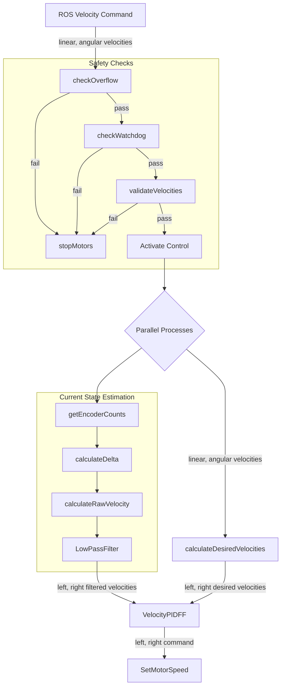

# Robot Control Improvements Documentation

## Table of Contents
1. [Overview](#Overview)
2. [Instructions](#Instructions)
2. [Teleoperation](#Teleoperation)
3. [PID Control](#PID-Control)
4. [AprilTag Improvements](#AprilTag-Improvements)
5. [Additional Features](#Additional-Features)

## Overview 
Branch containing improvements to the eBug robot control focusing on:
- **Teleoperation Implementation**: Added for direct testing and tuning of robot movements.
- **PID Control**: Improved velocity control for precise movements.
- **AprilTag detection optimisation**: Enhanced pose estimation accuracy.

## Instructions 
### Using the Program
1. Open a terminal and ssh into the eBug:
```bash
ssh ubuntu@ebug03
```
2. Navigate source directory:
```bash
cd ebug-network/ros/src
```
3. Run update commands: 
```bash
git fetch
git pull
chmod 755 update
docker container prune --force
docker image prune --force
docker rmi ebug
docker build -t ebug .
```
4. Launch dockerfile: 
```bash
docker run --net host --ipc host --pid host \
        -e ROBOT_ID=$HOSTNAME -e CAMERAS='cam_0,cam_1,cam_2,cam_3' \
        --device /dev/video0 --device /dev/video1 \
        --device /dev/video2 --device /dev/video3 \
        --device /dev/video4 --device /dev/video5 \
        --device /dev/video6 --device /dev/video7 \
        --device /dev/i2c-1 --rm -it ebug
```
5. Open seperate terminal on your local PC containing the ebug-network folder and run: 
```bash
sudo bash
source /opt/ros/humble/setup.bash
export ROS_DOMAIN_ID=13
```
6. With your local instance, run the principal.launch.py (build the instance if you have to): 
```bash
cd ebug-network/ros/src
colcon build
source install/setup.bash
ros2 launch ebug principal.launch.py
```

7. On your eBug terminal, run the teleoperation launch file after the principal is built: 
```bash
ros2 launch ebug teleop.launch.py
```

8. Open a seperate terminal and run the teleop command (rename eBug to the appropriate number):
```bash
sudo bash
source /opt/ros/humble/setup.bash
export ROS_DOMAIN_ID=13
ros2 run teleop_twist_keyboard teleop_twist_keyboard --ros-args -r /cmd_vel:=/ebug03/cmd_vel
```
### Tips and Tricks 


## Teleoperation

Teleoperation focuses on allowing the eBug to accept velocity command inputs from ROS and performing these commands over the network. 

### Modified Files
- `RobotController.py`: Added `cmd_vel_callback` subscription
- `teleop.launch.py`: New launch file added
- `PololuHardwareInterface.py`: Added `write_velocity()`, `read_odometry()` and `reset_odometry()`

### Key Changes
- Implemented Twist message subscription in `RobotController.py` for manual control
- `write_velocity()`
    - Direct velocity commands for motors
    - Used by both PID and teleoperation
    - Takes linear and angular velocity parameters
- `read_odometry()`
  - Position and velocity feedback
  - Essential for PID control loops
  - Returns current robot state
- `reset_odometry()`
  - Resets position tracking to zero
  - Useful for initialization
  - Called during startup or recalibration
- Command usage:
  ```bash
  ros2 run teleop_twist_keyboard teleop_twist_keyboard --ros-args -r /cmd_vel:=/ebug03/cmd_vel
## PID Control
PID control ensures that the robot is accurately performing these movement commands without the use of other sensors, and relying only on it's odometry. 

### Modified Files
- `RomiRPISlave.ino`: previously called `RomiRPISlaveLED.ino`

### Key Changes
- Previous control system used direct motor PWM values. The new system takes in velocity commands from ROS and applies motor commands to the wheels through `velocityToMotorCommand()`
- Robot Poses are now calculated in the arduino and sent to ROS. Previously was calculated in the Rasperry Pi. 

### Updated System Overview


## AprilTag Improvements
Tuning the EKF covariances and improving the AprilTag Detection. 
### Modified Files
- `EKFAbsolute.yaml`: Covariance tuning.
- `TransformConverter.py`: Improved camera perspective geometry and added a quadratic scaling covariance matrix.
### Key Changes
- Previous iteration polls through four cameras to detect AprilTags. New system only uses one camera due to the power constraints, at a lower frame rate (10 fps) and smaller resolution (320x240). 
    - As the robot's odometry is now improved, it relies less on the AprilTag localisation and has more trust in it's motors. 
    - Note: Four cameras can still be used, but will lose the ability to SSH into the robot for debugging and monitoring. 
- The EKF covariance uses a scaled covariance matrix, where closer AprilTag detections are more certain than further AprilTag detections. 

## Additional Features
### Gyroscope Sensor Fusion 
The gyroscope is implemented with the robot and fused with the encoder sensors to improve the orientation in the z-axis.