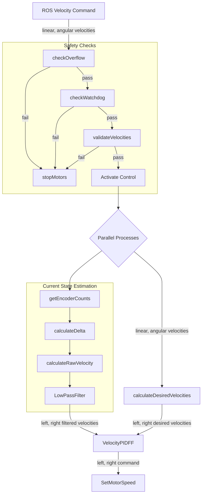

# Robot Control Improvements Documentation

## Table of Contents
1. [Overview](#Overview)
2. [Instructions](#Instructions)
2. [Teleoperation](#Teleoperation)
3. [PID Control](#PID-Control)
4. [AprilTag Updates](#AprilTag-Updates)
5. [Next Steps and Improvements](#Next-Steps-and-Improvements)

## Overview 
This document highlights the latest improvements to the eBug system, making it easier to develop more advanced features while enhancing its core functionality. For full eBug capabilities, refer to the main branch. The key updates in this version include: 
- **Teleoperation Implementation**: Added for direct testing and tuning of robot movements.
- **PID Control**: Improved velocity control for precise movements.
- **AprilTag detection optimisation**: Enhanced pose estimation accuracy.

## Instructions 
Preface: It is recommended that all devices are connected to the same network.
The current eBug's are setup to connect to the network *lightrobot*. Another computer would hotspot the wifi (*eduroam*) and name it's network *lightrobot*.
### Using the Program
1. Open a terminal and ssh into the eBug:
```bash
ssh ubuntu@ebug03
```
2. Navigate source directory:
```bash
cd ebug-network/ros/src
```
3. Run update commands: 
```bash
git fetch
git pull
chmod 755 update
docker container prune --force
docker image prune --force
docker rmi ebug
docker build -t ebug .
```
4. Launch dockerfile: 
```bash
docker run --net host --ipc host --pid host \
        -e ROBOT_ID=$HOSTNAME -e CAMERAS='cam_0,cam_1,cam_2,cam_3' \
        --device /dev/video0 --device /dev/video1 \
        --device /dev/video2 --device /dev/video3 \
        --device /dev/video4 --device /dev/video5 \
        --device /dev/video6 --device /dev/video7 \
        --device /dev/i2c-1 --rm -it ebug
```
5. Open seperate terminal on your local PC containing the ebug-network folder and run: 
```bash
sudo bash
source /opt/ros/humble/setup.bash
export ROS_DOMAIN_ID=13
```
6. With your local instance, run the principal.launch.py: 
```bash
cd ebug-network/ros/src
colcon build
source install/setup.bash
ros2 launch ebug principal.launch.py
```

7. On your eBug terminal, run the teleoperation launch file:
```bash
ros2 launch ebug teleop.launch.py
```

8. Open a seperate terminal and run the teleop command:
```bash
sudo bash
source /opt/ros/humble/setup.bash
export ROS_DOMAIN_ID=13
ros2 run teleop_twist_keyboard teleop_twist_keyboard --ros-args -r /cmd_vel:=/ebug03/cmd_vel
```
### Tips, Debugging and Monitoring 
It requires 3 seperate terminals to run teleoperation: the **Principal**, a local instance publishing the AprilTags global position, 
the **Teleoperation Launch**, an instance on the eBug that communicates to the network, 
and the **ROS2 Teleoperation Commands**, a local instance using the ROS2 teleop_twist_keyboard package.
#### Common Errors ####
- `sudo bash` is required in your local instances have permisson to communicate with the eBugs.  
- `export ROS_DOMAIN_ID=13` is required to ensure that the instances are communicating on the same domain.
- If ssh ubuntu@ebug03 doesn't work, it is recommended to find the eBug's IP address and directly ssh into it.

#### Monitoring ####
Monitoring can be performed using another terminal instance connected to the domain. Common commands used: 
- `ros2 topic list`: Print which topics are published 
- `ros2 topic echo /ebug03/ekf_absolute --field "pose.pose"`: Print the ekf_absolute poses without the covariances. 
- `ros2 topic echo /ebug03/imu --field orientation`: Print IMU orientation
- `ros2 run rqt_image_view rqt_image_view`: Camera view on eBug. 
- `ros2 topic echo /ebug03/tf_detections`: AprilTag detection on eBug. 


## Teleoperation

Teleoperation focuses on allowing the eBug to accept velocity command inputs from ROS and performing these commands over the network. 

### Modified Files
- `RobotController.py`: Added `cmd_vel_callback` subscription
- `teleop.launch.py`: New launch file added
- `PololuHardwareInterface.py`: Added `write_velocity()`, `read_odometry()` and `reset_odometry()`

### Key Changes
- Implemented Twist message subscription in `RobotController.py` for manual control
- `write_velocity()`
    - Direct velocity commands for motors
    - Used by both PID and teleoperation
    - Takes linear and angular velocity parameters
- `read_odometry()`
  - Position and velocity feedback
  - Essential for PID control loops
  - Returns current robot state
- `reset_odometry()`
  - Resets position tracking to zero
  - Useful for initialization
  - Called during startup or recalibration
- Command usage:
  ```bash
  ros2 run teleop_twist_keyboard teleop_twist_keyboard --ros-args -r /cmd_vel:=/ebug03/cmd_vel
## PID Control
PID control ensures that the robot is accurately performing these movement commands without the use of other sensors, and relying only on it's odometry. 

### Modified Files
- `RomiRPISlave.ino`: previously called `RomiRPISlaveLED.ino`

### Key Changes
- Previous control system used direct motor PWM values. The new system takes in velocity commands from ROS and applies motor commands to the wheels through `velocityToMotorCommand()`
- Robot Poses are now calculated in the arduino and sent to ROS. Previously was calculated in the Rasperry Pi. 

### Updated System Overview
*Note: Install mermaid to see the system diagram*.

## AprilTag Updates
Tuning the EKF covariances and improving the AprilTag Detection. 
### Modified Files
- `EKFAbsolute.yaml`: Covariance tuning.
- `TransformConverter.py`: Improved camera perspective geometry and added a quadratic scaling covariance matrix.
### Key Changes
- Previous iteration polls through four cameras to detect AprilTags. New system only uses one camera due to the power constraints, at a lower frame rate (10 fps) and smaller resolution (320x240). 
    - As the robot's odometry is now improved, it relies less on the AprilTag localisation and has more trust in it's motors. 
    - Note: Four cameras can still be used, but will lose the ability to SSH into the robot for debugging and monitoring. 
- The EKF covariance uses a scaled covariance matrix, where closer AprilTag detections are more certain than further AprilTag detections. 

## Next Steps and Improvements
### WIP: Gyroscope Sensor Fusion 
The gyroscope is implemented with the robot and fused with the encoder sensors to improve the orientation in the z-axis.
Unfortunately, the tuning process for the gyroscope was problematic and not implemented correctly, in which it was removed. 
`EKFrelative.yaml` is responsible for the gyroscope fusion, in which the output would be used as an input for
the `EKFabsolute.yaml`. Essentially there would be 2 fusions, encoders to gyroscope for the relative poses, and subsequently fused with
AprilTag localisation. This method should be investigated, but currently the encoders and the AprilTags localisation provide satisfactory results. 

To get started with the gyroscope fusion, there are two major changes. 
- `ekfRelative.yaml`: 
  - `pose0` to be updated with `/ebug03/imu`, and the covariances should be tuned. 
- `teleop.launch.py`:
  - uncomment the `ekf_filter_relative` node 
  - remap `('odom0', f'/{ROBOT_ID}/ekf_relative')` in the ekf_filter_absolute node. This ensures that the gyroscope-encoder fusion is taken as an input in the ekf_filter_absolute node. 

### Merging with Main Branch 
Teleoperation, PID control, and updating the AprilTag detection are basic foundations aimed to improve the user expererience for complex functions such as Boid's algorithm, visualisations, RL Models and multi-robot localisation techniques. It is suggested that these improvements should be carefully integrated into the main branch, and the previous functions, such as Boid's Algorithm, should be compatible with these new changes. Some major issues that should be addressed are: 
- **Boids Function and Movement**: 
  - Previous iteration sent left and right desired motor signals, and this basis was built as a foundation for all services (*BoidsService.py, DiscoService.py, MovementController.py*). 
  - To implement the PID controller and ensure that all robot dynamics are handled in the Arduino, the left and right desired motor signals are omitted, and RPI now sends linear and angular velocities, and the Arduino returns the message with orientation x, y, and theta.
  - Essentially, all low level functions such as eBug dynamics and PID control are handled inside the Arduino to save computational power. RPI communicates the movement commands, handles EKF and AprilTag localisation, and publishes the eBug's pose to the network. 
  - Boids Service, Disco Service and the Movement controller should all be intergrated with this new update such that Boid's Algorithm can run with the new updates. 
- **eBug LEDs**: 
  - The lights have been deactivated temporarily during these updates. 

### eBug Camera
The current implementation only uses 1 camera with very minimal performance to ensure low computational load. However the previous iteration had better camera implementation with 4 cameras used, polling through each camera at a higher resolution and frame rate. Either method is fine, as both perform quite well. 

### Working with Docker Containers 
VScode allows coding inside Docker instances. In my current workflow, I would have a VSCode that would ssh into the eBug as well as having a ssh terminal into eBug to run bash commands. Once I run the docker container in the terminal, I would use the VSCode remote explorer and open up the Dev Container that is active. In that way, I can make changes inside the docker container, run the bash commands with the Docker Terminal `colcon build` and `source install/setup.bash`, such that I would not need to exit the docker container, make changes in the eBug, rebuild the docker instance and run it. Rebuilding docker instances is required for any new changes and tend to take a very long time (10 to 15 minutes). A flaw with this method is that I haven't found a way to directly commit and push new changes from the Docker container to the Github, which I would constantly copy and paste new changes from the Docker to the eBug files, and then push from there. 
