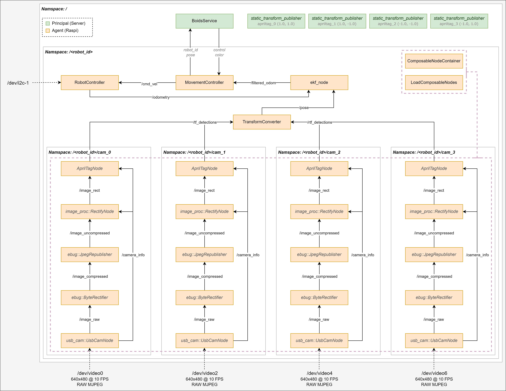

## Overview



## Notice
***Please note, Docker Desktop for Windows has some unsupported features and cannot be used.***
*Either install Docker Engine directly in WSL, create a Linux-based VM, or dual-boot your device.*

***Please note, on some platforms, `sudo` maybe be required to execute docker commands.***
*Alternatively, on Linux, a user group can be created for docker and the current user added.*

*Please note, many of the following commands and processes will be dramatically simplified once deployment is refined and a docker-compose configuration is created.*


## Docker Networking
Before building and launching any of the containers, we need to create a specialized network device.
The default bridge network will not allow the containers to communicate externally, out of `host.docker.internal`.
Additionally, the built-in host networking will consolidate the nodes onto a single MAC Address, which can cause issues with FastDDS.

To address these considerations, we need to create a MAC Vlan driver to bind the containers to. 
This will allocate a unique MAC Address to each container, as if they were their own physical devices.

```sh
    sudo docker network create --driver ipvlan --subnet 192.168.0.0/24 --opt parent=eth0 --opt ipvlan_mode=l3 ebug_ipvlan

    # Firstly, identify the interface, gateway and subnet of the host device
    ip route

    # From here on out we will assume the interface is ->  eth0
    # From here on out we will assume the gateway is ->  192.168.1.1
    # From here on out we will assume the subnet (CIDR notation) is ->  192.168.1.0/24

    docker network create \
        --driver macvlan \                      # Create a MAC VLAN type network
        --subnet 192.168.1.0/24 \               # CIDR notation subnet of host device
        --gateway 192.168.1.1 \                 # Gateway address of host device
        --ip-range 192.168.1.192/28 \           # Assign up to 16 ip addresses from 192 to 208 (Can change)
        --aux-address 'mac0=192.168.1.192' \    # First address of the ip range is reserved for the bridge interface 
        --opt parent=eth0 \                     # Specify which host interface to bind to
        ebug_macvlan                            # Name the MAC VLAN network

    # Or more compactly written:
    docker network create --driver macvlan --subnet 192.168.1.0/24 --gateway 192.168.1.1 --opt parent=eth0 ebug_macvlan

    # To delete the MAC VLAN
    docker network remove ebug_macvlan

    # You can list the existing docker network interfaces using
    docker network list
```


## Host Networking

By default, connections directly between the container and host device will be blocked, to enable this we create a bridge.
*This is only required for developed purposes and the simulation.*

```sh
    # We now want to create a bridge between the macvlan driver that docker uses, and the desired interface.
    # We'll have to pick a static address for this bridge, that is not already in use on the subnet.

    # From here on out we will assume the interface is ->  eth0
    # From here on out we will assume the desired address is ->  192.168.1.2
    #   Combined with the CIDR subnet, /24 in this example we get ->  192.168.1.2/24

    # Install net tools to use ifconfig
    sudo apt-get install -y net-tools

    # Create the mac0 interface and bridge it to eth0
    sudo ip link add mac0 link eth0 type macvlan mode bridge
    sudo ip addr add 192.168.1.192/28 dev mac0
    sudo ifconfig mac0 up

    # You should now be able to view the bridge, mac0, along with the other interfaces
    ifconfig

    # To validate this connection, run a container and try to ping it
    # Firstly, find the address of the container
    docker network inspect ebug_macvlan
    ping 192.168.1.193

    # Or check the ros topics are listed
    ros2 topic list
```


## Build Container
The Principal, Agent, and Client instances can all be deployed using the base Ebug container.
The container can be built as follows, optionally providing a `ROS_DOMAIN_ID`, which defaults to 13.

```sh
    # Build the ebug container, with a default ROS_DOMAIN_ID (13).
    docker build -t ebug .

    # Or, build the ebug container with a specified ROS_DOMAIN_ID
    docker build --build-arg DOMAIN_ID=13 -t ebug .
```


## Principal
This ROS2 container implements Boids in a global scope. 
Agents should query the Principal to determine their next course.

The Principal must be run on the central compute server.

```sh
    # Run the ebug container
    docker run --network ebug_macvlan --rm -it ebug

    # In the containers interactive terminal, start the Principal
    ros2 launch ebug_principal ebug_principal.launch.py
```


## Agent
This ROS2 container implements localisation component(s)
An Agent should be instantiated for each corresponding Client.

The Agent can either be run on each robot' Raspberry Pi, or on the central compute server.

The robot ID should be passed in as an environment variable, `ROBOT_ID`, using docker run or docker-compose.

The robot algorithm can also be passed in as an environment variable, `ROBOT_ALGO`, using docker run or docker-compose.
If left blank, ROBOT_ALGO will default to 'BoidsService'.

```sh
    # Run the ebug container, with a specified ROBOT_ID and ROBOT_ALGO
    docker run --network ebug_macvlan -e ROBOT_ID='robot_0' -e ROBOT_ALGO='BoidsService' --rm -it ebug

    # In the containers interactive terminal, start the Agent
    ros2 launch ebug_agent ebug_agent.launch.py
```

## Client
This ROS2 container implements camera, polling, and movement component(s)
A Client should be instantiated for each robot in the swarm, corresponding with an Agent instance.

The Principal must be run individually on each robot in the swarm.

The robot ID should be passed in as an environment variable, `ROBOT_ID`, using docker run or docker-compose.

By default, camera polling is disabled, it can be enabled by setting the environment variable `CAMERA_POLLING` to `enabled`.
Doing so will enable the remaining three cameras on the robot, as well as the polling logic to alternate between them.

*Please note: Currently the I2C connection has not been validated.*

```sh
    # Run the client container, with a specified ROBOT_ID and passing through I2C-1
    # ebug_client.util.PololuHardwareInterface creates an SMBus on I2C-1
    docker run --network ebug_macvlan -e ROBOT_ID='robot_0' --device /dev/i2c-1 --rm -it ebug

    # In the containers interactive terminal, start the Client
    ros2 launch ebug_client ebug_client.launch.py
```


