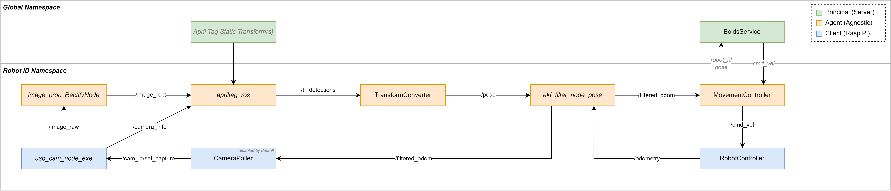

## Overview


## Principal
This ROS2 container implements Boids in a global scope. 
Agents should query the Principal to determine their next course.

The Principal must be run on the central compute server.

```sh
    # Build the principal container, with src as the working directory
    docker build -t ebug_principal . -f Principal.Dockerfile

    # Run the principal container
    docker run -it ebug_principal
```

## Agent
This ROS2 container implements localisation component(s)
An Agent should be instantiated for each corresponding Client.

The Agent can either be run on each robot' Raspberry Pi, or on the central compute server.

*Please note: Currently the ROBOT_ID is hardcoded in `ebug_agent/launch/ebug_agent.launch.py`.*
*This will change in future to be an environment variable, configurable via docker-compose.*

```sh
    # Build the agent container, with src as the working directory
    docker build -t ebug_agent . -f Agent.Dockerfile

    # Run the agent container
    docker run -it ebug_agent
```

## Client
This ROS2 container implements camera, polling, and movement component(s)
A Client should be instantiated for each robot in the swarm, corresponding with an Agent instance.

The Principal must be run individually on each robot in the swarm.

*Please note: Currently the ROBOT_ID is hardcoded in `ebug_client/launch/ebug_client.launch.py`.*
*This will change in future to be an environment variable, configurable via docker-compose.*

*Please note: Currently the Client container does not enable the I2C connection, causing SMBus errors.*

```sh
    # Build the client container, with src as the working directory
    docker build -t ebug_client . -f Client.Dockerfile

    # Run the client container
    docker run -it ebug_client
```


